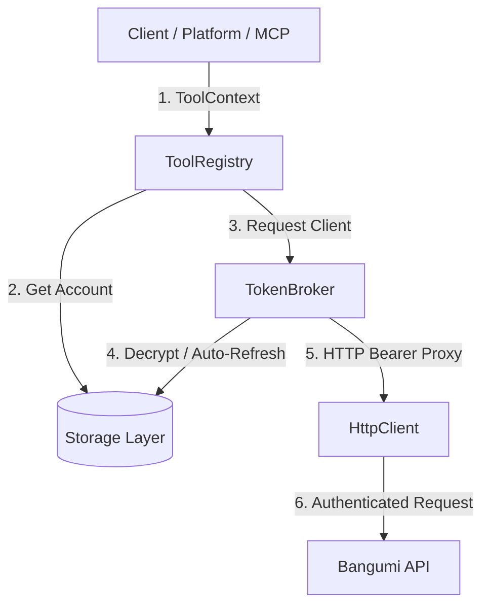

# Bangumi OAuth & Multi-Tenant Token Architecture

## 架构概述

Bangumi Agent Kit 的 OAuth 与多租户 Token 架构由以下核心组件构成：

---

## 核心接口与数据模型

1. **Storage Protocol (`packages/db`)**
   - 支持 `MemoryStorage` (In-Memory Map + Mutex Lock) 与 `PostgresStorage` (Drizzle ORM / PostgreSQL atomic row locks).
   - 提供 `ExternalPrincipalRecord`, `BangumiAccountRecord`, `AccountBindingRecord`, `AccessCredentialRecord`, `OAuthSessionRecord`, `PendingActionRecord`, `AuditEventRecord`.

2. **Token Security (`packages/auth`)**
   - AES-256-GCM 算法对 Access Token / Refresh Token 进行静态与动态加密存储。
   - `OAuthStateStore`: 使用 SHA-256 state hash 存储 state，严格单次使用 (`OAUTH_STATE_REUSED`) 并防止重放。
   - `OAuthService`: 处理授权回调，创建账号绑定，保存与更新加密 Token。
   - `TokenBroker`: 提供并发锁 (`withCredentialLock`) 保证多个并发 API 请求遇到 Access Token 过期时仅触发一次上游刷新 (`refreshToken`)。

3. **Tool Policy & Execution (`packages/tools`)**
   - 实现了 8 步安全管线：
     1. Resolve Policy
     2. Assert Write & Confirmation Policy
     3. Execute Tool with Bound Client
     4. Mark Pending Action Succeeded / Failed
     5. Audit Logging.

---

## 最佳实践与注意要点

1. **绝对禁止在 ToolContext、日志或 Prompt 中传递明文 Token**。
2. **多进程/多容器部署必须配置 `DATABASE_URL` (PostgreSQL)** 以共享 DB 状态并进行原子并发锁控制。
3. **`BANGUMI_ALLOW_RAW_WRITES` 默认保持 `false`**。底层原始 API 写操作仅在开发调试环境下显式开启。
